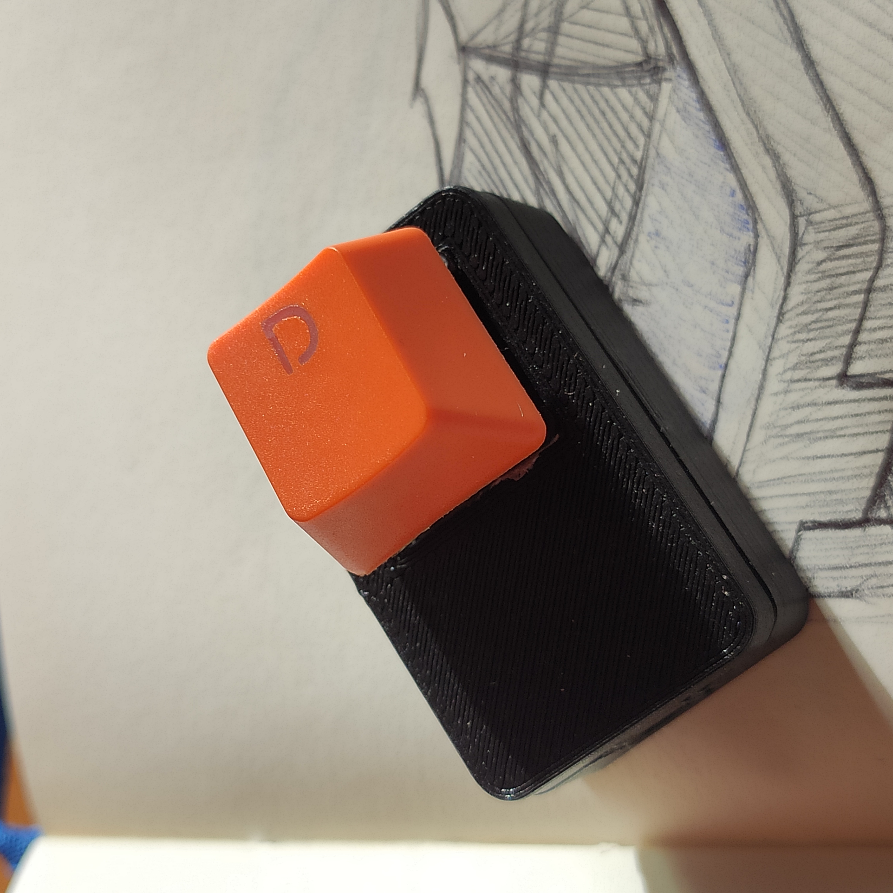

# Arduino Password button
Avoid typing long passwords by making a dedicated button to write them whenever you need. A simple and fun Arduino project.

## Disclosure
To make this project, I simply followed the [official Arduino example for Keyboard usage](https://docs.arduino.cc/built-in-examples/usb/KeyboardMessage). What I’m sharing here is the slightly modified version of the sketch, and the way I used it to make a password button.

## Warning
Use this at your own risk! I assume no responsibility for the usage of this project for storing passwords that protect valuable information.

---

## The finished project
The Fusion 360 files and STL files for 3D printing are available if you want to make one yourself.
